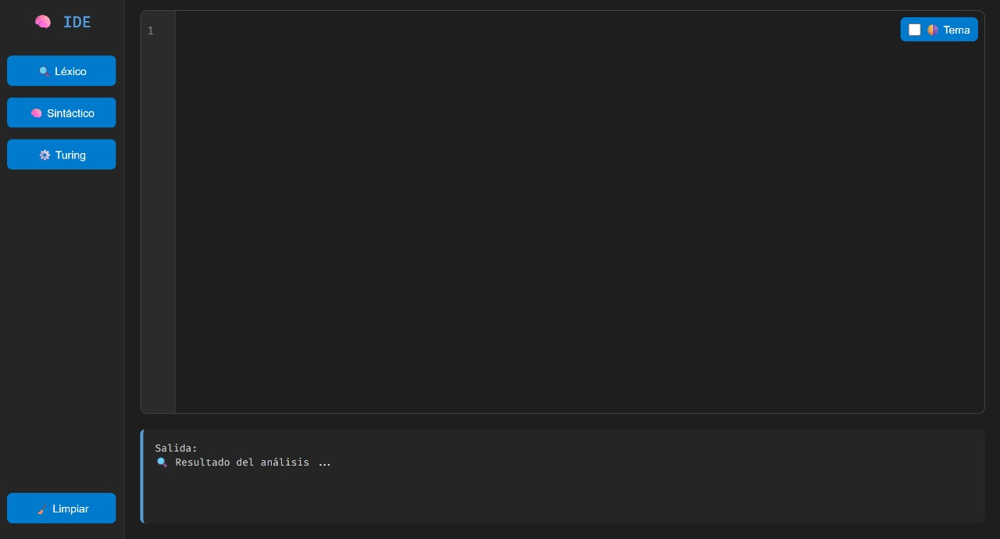
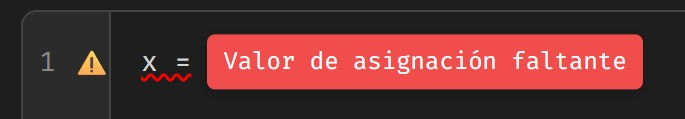

# IDE WEB
# Analizador Léxico-Sintáctico y Máquina de Turing
## Proyecto de Lenguajes y Autómatas


**Estudiante:** Hernández Storey Roberto de Jesús

**Profesor:** Molina Gomez Kevin David 

**Materia:** Lenguajes y Autómatas  

**Semestre:** 6to Semestre

## 📋 Descripción del Proyecto
Este proyecto implementa tres componentes principales:
1. Un analizador léxico
2. Un analizador sintáctico
3. Una máquina de Turing para detectar patrones humano/robot

## 🛠️ Tecnologías y Lenguajes Utilizados

### Backend (Python)
- `app.py`: Servidor web Flask que maneja las rutas y peticiones
- `lexer.py`: Analizador léxico implementado en Python
- `parser.py`: Analizador sintáctico implementado en Python
- `turing.py`: Implementación de la máquina de Turing en Python

### Frontend (HTML/CSS/JavaScript)
- `templates/index.html`: Interfaz principal del IDE
- `static/css/`: Estilos CSS para la interfaz
- `static/js/`: Scripts de JavaScript para la interactividad
- `static/img/`: Imágenes utilizadas en el proyecto

### Tecnologías Principales
- **Python**: Lenguaje principal del backend
- **Flask**: Framework web para Python
- **HTML5**: Estructura de la interfaz web
- **CSS**: Estilos y diseño responsivo
- **JavaScript**: Interactividad en el frontend

## 💻 Visualización del Proyecto

### Interfaz del IDE

*IDE con análisis léxico, sintáctico y máquina de Turing integrados*

## 🚀 Instrucciones de Ejecución

### Requisitos Previos
- Python 3.7 o superior
- Flask

### Instalación
1. Clona el repositorio o descarga los archivos
2. Instala las dependencias:
```bash
pip install flask
```

### Ejecución
1. Abre una terminal en la carpeta del proyecto
2. Ejecuta el servidor:
```bash
python app.py
```
3. Abre tu navegador y visita: `http://localhost:5000`

## 🔍 Especificación del Lenguaje

### Tokens Válidos
- **Palabras Clave:** if, else, while, for, return
- **Símbolos:** (, ), {, }, +, -, *, /, =
- **Números:** Cualquier secuencia de dígitos
- **Identificadores:** Nombres de variables válidos en Python

### Símbolos No Permitidos
- Punto y coma (;)
- Dos puntos (:)

### Reglas Sintácticas
1. No se permiten estructuras de control (if, while, for, etc.)
2. Cada línea debe ser una asignación
3. Las asignaciones deben tener un solo operador =
4. Los nombres de variables deben ser válidos
5. No se permiten líneas vacías (excepto saltos de línea)

## 📝 Ejemplos

### Códigos Válidos
```python
x = 42
variable_nombre = 100
resultado = 5
```

### Códigos Inválidos
```python
if x = 5          # Error: uso de estructura de control
variable  = 10;   # Error: uso de punto y coma al final
resultado: = 20   # Error: uso de dos puntos
= 30              # Error: falta nombre de variable
x = = 40          # Error: múltiples signos igual
```

## Ejemplo de Error Sintáctico


*Ejemplo de detección de error al pasar el cursor sobre el codigo: valor de asignación faltante en el código*

## 🤖 Máquina de Turing

### Descripción
La máquina de Turing implementada detecta si una cadena fue generada por un humano o un robot basándose en su último carácter.

### Reglas
- Cadenas que terminan en 'a' → HUMANO
- Cadenas que terminan en 'b' → ROBOT
- Solo se permiten los caracteres 'a' y 'b'

### Ejemplos
```
Entrada: aba
Resultado: HUMANO 🧍

Entrada: abb
Resultado: ROBOT 🤖

Entrada: abc
Entrada: 123
Resultado: ERROR ❓ (carácter inválido)
```

## 🔧 Estructura del Proyecto
```
proyecto/
│
├── app.py          # Servidor web Flask
├── lexer.py        # Analizador léxico
├── parser.py       # Analizador sintáctico
├── turing.py       # Máquina de Turing
│
├── templates/      # Plantillas HTML
│   └── index.html
│
└── static/         # Archivos estáticos
    ├── css/
    ├── img/
    └── jd/
```

## 📊 Evaluación de Entrada
1. El código ingresado primero pasa por el analizador léxico
2. Si no hay errores léxicos, pasa al analizador sintáctico
3. La máquina de Turing puede procesar cadenas independientemente

## 🤝 Contribuciones
Este es un proyecto académico desarrollado como parte del curso de Lenguajes y Autómatas.

## 📜 Licencia
Este proyecto es para uso educativo únicamente. 
